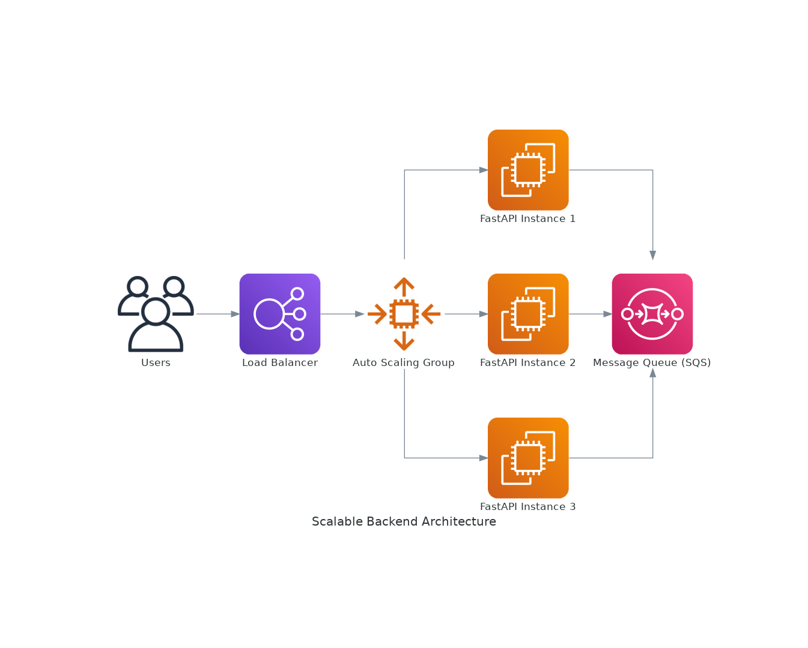

# FastAPI Backend Service

This project simulates a backend service running in the cloud, developed using **FastAPI**. The service interacts with mock external APIs and sends processed data to a message queue. It is designed with scalability, modularity, and high-quality code in mind. This document provides an overview of the design, key components, scalability considerations, and instructions for running the application in a cloud environment.


---

## Table of Contents
1. [Design Overview](#design-overview)
2. [Key Components](#key-components)
3. [Running the Program](#running-the-program)
    - [Local Setup](#local-setup)
    - [Running in a Docker Container](#running-in-a-docker-container)
    - [Deploying in a Cloud Environment](#deploying-in-a-cloud-environment)
4. [Testing](#testing)

---

## Design Overview

This project is structured around **FastAPI**, a modern Python web framework ideal for building APIs quickly and efficiently. The application is modular, with clear separations between the API client, business logic, and message queue interactions.

### Workflow:
1. **API Client** simulates interaction with a third-party API by fetching mock data.
2. **Business Logic** processes the fetched data (e.g., data transformation).
3. The processed data is sent to a **Message Queue** for further handling.
4. The service is designed to scale both horizontally (by running multiple instances) and vertically (by allocating more resources per instance).

---

## Key Components

1. **API Client Module (`api_client.py`)**: 
   - Responsible for fetching data from external APIs. In this project, mock responses are generated to simulate real-world behavior.

2. **Business Logic Module (`business_logic.py`)**: 
   - Handles the core data transformation and enqueues the processed data onto a message queue.

3. **Message Queue Module**: 
   - Simulates sending data to a message queue (e.g., Kafka, Azure Service Bus). The actual message queue is mocked in this case but can be replaced with a real service.

4. **Configuration (`config.py`)**: 
   - Provides flexibility for setting up different environments (development, production) through environment variables.

5. **Unit Tests**: 
   - Basic unit tests are provided for testing individual components like the API Client and business logic. These use mock objects to simulate external dependencies.

---

## Running the Program

### Local Setup

#### Prerequisites:
- Python 3.11 or higher
- FastAPI
- Uvicorn
- Docker (optional)

#### Steps:
1. **Clone the repository**:
   ```bash
   git clone git@github.com:GuidoBR/deck.git
   cd fastapi-backend-service
   ```

2. **Install dependencies**:
   ```bash
   pip install -r requirements.txt
   ```

3. **Run the FastAPI server**:
   ```bash
   cd backend_service ; uvicorn app.main:app --reload --port 8080
   ```

4. **Access the API**:
   The API will be accessible at `http://127.0.0.1:8080/docs`.

### Running in a Docker Container

1. **Build the Docker image**:
   ```bash
   docker build -t fastapi-backend-service .
   ```

2. **Run the Docker container**:
   ```bash
   docker run -p 8080:8080 fastapi-backend-service
   ```

3. **Access the API**:
   The API will be accessible at `http://127.0.0.1:8080/docs`.

---

### Running multiple instances with Ngninx as a Load Balancer

1. **Run the Load-Balanced App Locally**:
   ```bash
   docker-compose up --build
   ```

2. **Load Test with Locust**

You can run a load test on this service using [Locust](https://locust.io/), a scalable user load testing tool.

Run `locust` and set the target URL to http://localhost:8080 to distribute traffic to all FastAPI instances.


## Testing

You can run unit tests using `pytest` to ensure each component works as expected.

1. **Install testing dependencies**:
   ```bash
   pip install pytest
   ```

2. **Run tests**:
   ```bash
   pytest
   ```